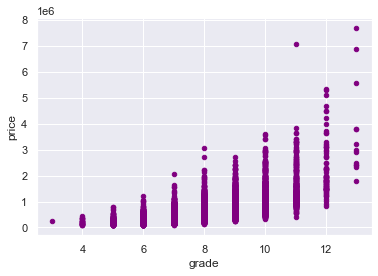
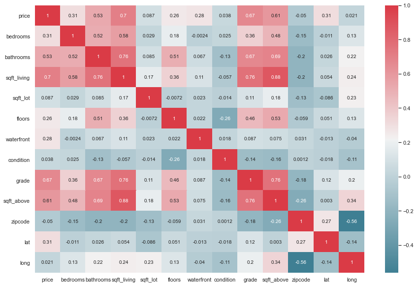

# Elodin Realty Portfolio Focus

 Author: Luca Francesco Caruccio

## Overview

The focus of this project is to analyze real estate data for correlations relating to sales pricing, in an effort to accurately estimate a house's value based on one or more characteristics. Visual Analysis shows high price correlation across several factors: 'Living Space', 'bedrooms' (number of), 'bathrooms' (number of), and 'grade'. Living space, or the interior property space, has been shown to be the best method for price estimation. In respective order, the most valuable factors for price projection were, in respective order: Living space, grade, bathrooms, then bedrooms. There were a dozen factors to choose from, all of which influnced price to some degree, be it positively or negatively, however since the aim of this project is to help reliably recommend properties in the future, finding a way to reflect a sales price from alternative factors seemed like the most prudent course of action.

## Business Problems

The realty group exploring their portolfio options, Elodin Realty, is relatively new. Their goal is to start growing their business, and their brand. The best method for this is to find solid investments that can grow in value, or be appropriately renovated. Like all good businesses, they are looking for reliable investments, preferably low risk and high reward. The business goal is to analyze the available data so Elodin Realty can make informed decisions on upcoming investments, and reasonably estimate a sale price based on other factors, whichever happens to be the best the best indicator, in this case, 'Living Space'.

### The Data and Methods

The available data maps 20,000 homes on the market in King County, Washington. The data on these houses includes over a dozen variables, most of which I will be checking for correlation with Price. Half a dozen points were dropped as they were not necessary for this analysis, such as 'i.d. number', or neighbors lot sizes. After replacing the missing values and converting the data type where appropriate, we can take a look at the correlation of our four main factors with price. After evaluating the four factors, I proceeded to analyze the highest correlating factor using linear regression.

## Results

## Conclusions

There are several main conclusions that can be drawn from this data'

1. Correlation between Price and Condition is low, but still positive, this could provide an opportunity to purchase large floor space, low-to-medium condition houses and prep them for renovation.
2. The most important factors to increase the price of a home are, respectively, Living Space, Grade, Bedrooms, and Bathrooms.
3. Living Space is the best indicator of the potential value of a home, and can be used to estimate a home's value to see whether it warrans an appraisal, saving time, energy, and revenue.

## Next Steps and Future Work

As far as next steps go, now that we know how to analyze a houses potential value, just as important would be to find a way to increase the value. Which renovations, additions, or separations would be statistically the most reliably profitable, and why? This would not only provide further insight for Elodin Realty on their business, but also help them conduct it more profitably, avoiding time consuming, low yield renovations. 

Which properties would be best suited for renovation? Would it be organized by what's missing, or what's already there? What would the ideal price range be? Where would the lines be drawn for a lost cause, and the point of diminishing return?

Lastly, how does location affect all of these factors? Neighborhoods are obviously a very important factor, and it would be fascinating to explore what makes a neighborhood "up-and-coming," and what needs it might have to become so, how many houses need to be renovated and sold to make a neighborhood increase in value singificantly? Using location data would be invaluable to identify areas that fit the previous descriptions, but are perhaps over looked. These could beome invaluable long term holds, or short sells to other groups that recognize their value.

## For more information

See Jupyter Notebook, 

Contact information:

lfcaruccio@gmail.com

Github acct: luca-caruccio

Linkedin: Luca Caruccio

### Repository Structure
-Introduction

-Business Problems

-Data Cleaning and Methods

-Analysis 

-Conclusions

-Next Steps

